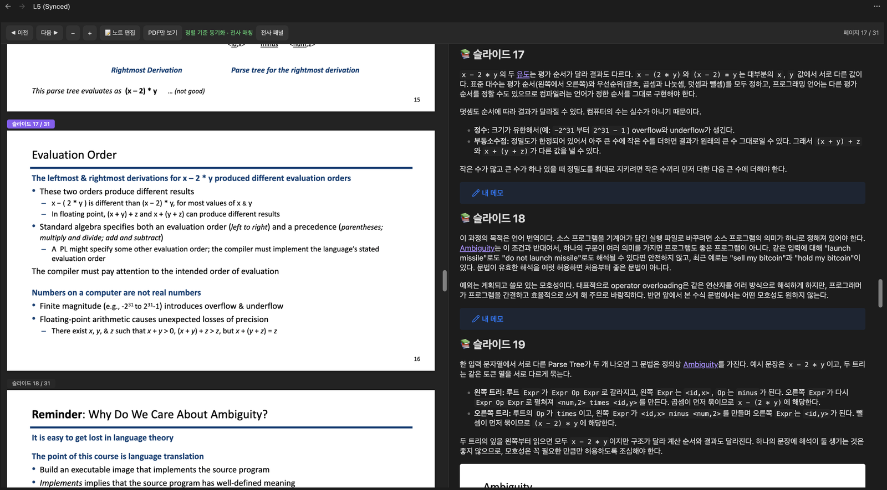
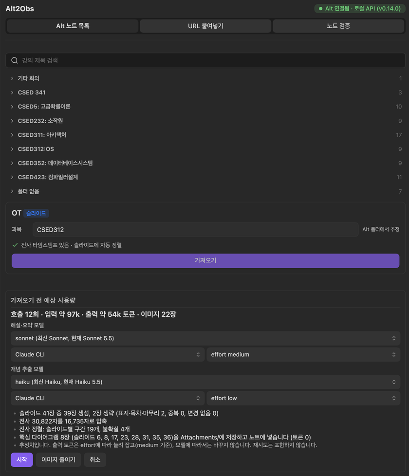

<div align="center">
  
  <h1>Alt2Obs</h1>
  <p><strong>Turn Alt lecture recordings and slides into connected Obsidian notes.</strong></p>
  <p>
    <a href="docs/user-guide.md">User guide</a> ·
    <a href="README.ko.md">한국어</a> ·
    <a href="https://github.com/BiQnT/alt2obsidian/releases">Releases</a> ·
    <a href="https://github.com/BiQnT/alt2obsidian/issues">Report a bug</a>
  </p>
</div>

Alt2Obs is for students who record their lectures with the [Alt](https://www.altalt.io) app. It reads the lectures in the Alt desktop app on your computer and writes one note per lecture into your vault: a section for every slide, with commentary that your own Claude Code or Codex CLI writes from the slide and the part of the recording that covers it, plus concept notes linked with `[[wikilinks]]`. You study in a viewer that scrolls the PDF and the note together, and your own memos survive every re-import.

The interface and the generated notes are in Korean, with academic terms kept in English. Alt2Obs was named **Alt2Obsidian** before 2.0.0; its plugin id is still `alt2obsidian`.

<p align="center">
  
  <br>
  <em>The Synced Viewer: slide PDF and lecture note side by side, with the transcript panel open.</em>
</p>

## Features

- **Import straight from Alt.** The sidebar lists the lectures of the Alt desktop app on this computer by Alt folder, with search and a status for each one (new, imported, slides changed). No share link is needed, and Alt's summary and memo come along. A public Alt share link works as a fallback.
- **Commentary for every slide.** Your Claude Code or Codex CLI writes a section per slide from the slide text (plus the image, for diagram slides) and that slide's part of the transcript. Cover, contents and closing slides and repeated animation steps need no model call, and key diagrams can be saved as images into the note.
- **Transcript matched to slides.** For lectures from the Alt app, a script matches the timestamped transcript to the slides, with no tokens spent, so each slide gets what was said while it was on screen.
- **Synced Viewer.** The slide PDF and the note side by side, scrolling together. A transcript panel shows the current slide's part of the transcript with `[mm:ss]` times. Opening a lecture PDF opens the viewer.
- **Lectures without slides.** A lecture with only a recording becomes a summary note with a section for about every 12 minutes, each point stamped with its `[mm:ss]` time. Or attach the lecture PDF and import it as a slide lecture.
- **Check your own notes.** Compare notes you wrote (a file in the vault, pasted text, or a Notion page through your Notion MCP) with the slides and the transcript. Each claim gets a verdict with links to its evidence, and slides your notes left out are listed.
- **Memo-safe re-import.** Your `> [!note] 내 메모` (my memo) callouts and anything you write outside the managed blocks stay when you import again, and memos follow their slide when slides are added, removed or reordered. Only changed slides are generated again.
- **Your model, your budget.** Pick the provider, model and effort for each task, or use a preset. Before every run you see the estimated calls, tokens and images, can switch the model for that run, and can cancel at any time. Actual usage is recorded in the note and in the settings.
- **Concept notes.** Key concepts become notes named `English (한국어)`, such as `Pipeline Hazard (파이프라인 해저드)`, linked from the commentary and reused across the lectures of a subject.

<p align="center">
  
  <br>
  <em>Pick a lecture from Alt and see the estimated usage before anything runs.</em>
</p>

## Requirements

- **Obsidian 1.7.2 or later, desktop.** The plugin is desktop only. It is used on macOS; Windows and Linux are covered by unit tests only.
- **The Alt desktop app** on the same computer, for the local lecture list. Without it you can still import from a public Alt share link. While Alt is closed the plugin reads a copy of Alt's database, which needs an Obsidian build with Node 22.5 or later (`node:sqlite`); otherwise start Alt.
- **Claude Code or Codex CLI**, installed and logged in. Generation runs on your own plan: a Claude account with Claude Code access (a paid Claude plan or Anthropic API credits), or a ChatGPT plan that includes Codex (or an OpenAI API key).
- Optional: a Notion account and the Notion MCP in Claude Code, to check notes you keep in Notion.

## Install

**Community plugins.** Open **Settings → Community plugins**, turn off Restricted mode if it is on, select **Browse**, search for "Alt2Obs", then **Install** and **Enable**. Installs from the directory update in place like any listed plugin.

**Manually.** Download `main.js`, `manifest.json` and `styles.css` from the [latest release](https://github.com/BiQnT/alt2obsidian/releases/latest) into `<vault>/.obsidian/plugins/alt2obsidian/`, reload Obsidian and enable **Alt2Obs** under **Settings → Community plugins**.

**BRAT.** Add `BiQnT/alt2obsidian` as a beta plugin in [BRAT](https://github.com/TfTHacker/obsidian42-brat) to follow new releases.

### Upgrading from Alt2Obsidian 1.x or 2.0.0

- **From 1.x or a 2.0.0 beta**: the update installs in place (same id and folder) and keeps your settings, records and hotkeys. Notes and memos stay as they are. To move 1.x notes into the 2.0 folder layout, run **Migrate 1.x vault layout** from the command palette. Gemini API and Ollama support is gone; if you need it, stay on [1.1.0](https://github.com/BiQnT/alt2obsidian/releases/tag/1.1.0). CSS snippets written for the old `alt2obsidian-*` classes need the `alt-to-obs-*` classes.
- **From 2.0.0 (id `alt-to-obs`)**: Obsidian sees 2.0.0 and later versions as two plugins, both named Alt2Obs. Disable 2.0.0 without deleting it, then enable the new version: it imports 2.0.0's settings and records once and tells you so. Then delete 2.0.0 and set any hotkeys again. The [user guide](docs/user-guide.md#coming-from-200-id-alt-to-obs) has the details.

## Quick start

1. Install Claude Code or Codex and log in once in a terminal (`claude`, or `codex login`).
2. Enable Alt2Obs and open **Settings → Alt2Obs**. The **LLM 연결** (LLM connection) cards should show your CLI with its path and version.
3. Select the book icon in the ribbon (**Alt 강의 가져오기**, import an Alt lecture) to open the sidebar. In the **Alt 노트 목록** (Alt note list) tab, pick a lecture and check its subject.
4. Select **가져오기** (import), review the estimated usage, then select **시작** (start).
5. The note opens in the Synced Viewer. Write your own notes in the `> [!note] 내 메모` callout under each slide.

The [user guide](docs/user-guide.md) covers every option, lectures without slides, note checking and troubleshooting.

## Privacy and disclosures

Alt2Obs has no telemetry, analytics, ads or update checks. This is everything it sends, needs and touches outside your vault.

### Network use

- **Anthropic (Claude Code) or OpenAI (Codex).** Commentary, summaries, concept extraction, the optional alignment check and note checking run your own CLI (`claude` or `codex`) as a child process. For each call the CLI sends that call's lecture material to Anthropic or OpenAI under your account: slide text, slide images for diagram slides, transcript excerpts, Alt's summary and memo, concept names, and for note checking the sentences of your note with their evidence. The plugin itself sends nothing to these services.
- **Notion (optional, note checking).** Fetching a Notion page is one Claude Code call that may use only the fetch tool of your Notion MCP server, so Claude Code contacts Notion (and Anthropic for the model turn).
- **altalt.io and Alt's slide storage (optional, share link import).** The plugin downloads the Alt share page from altalt.io, then the slide PDF from the signed link on that page, which points to Alt's slide storage (Cloudflare R2, `*.r2.cloudflarestorage.com`; older notes may point to Alt's earlier Supabase storage, `*.supabase.co`).
- **Alt's local API** is reached on 127.0.0.1, on this computer only.
- Nothing else.

### Accounts and payment

The plugin is free. Its main features need an LLM CLI login: a Claude account with Claude Code access (a paid Claude plan or Anthropic API credits) or a ChatGPT plan that includes Codex (or an OpenAI API key). Every call counts against your plan's limits or your API usage. Optional: a Notion account for the Notion MCP. Your lectures come from the Alt app and your Alt account; the plugin never signs in to Alt.

### Files and programs outside the vault

- **Alt's data folder**, read only (macOS `~/Library/Application Support/alt`, Windows `%APPDATA%\alt`, Linux `~/.config/alt`, or the folder set in the settings): the local API token and server config, the slide PDFs, and, while Alt is not running, a private copy of Alt's database in a temp folder that is removed afterwards. The token is kept in memory only. This is needed to list and import your lectures without a share link.
- **Alt's port.** Before the token is sent to Alt's local API, the plugin checks that the program listening there is Alt, run by you: `lsof` and `ps` (macOS), `/proc` (Linux), `netstat` and `tasklist` (Windows).
- **The CLIs** are found through your login shell (`command -v`), `where` (Windows) and common install folders, and checked with `--version`, `--help`, `claude auth status`, `codex login status` and `claude mcp list` / `claude mcp get` (no model calls). Each call runs in a temp folder that is removed afterwards; on Windows a cancelled call is ended with `taskkill`. Claude Code runs with all its tools turned off. Codex runs in its read-only sandbox, which can still read files your account can read; the prompt tells it to use only the material it is given, but choose Codex only if you accept that.
- **Read for the model lists:** `~/.claude/cache/model-catalog/*-cc.json` (or under `$CLAUDE_CONFIG_DIR`) and `~/.codex/models_cache.json` (or under `$CODEX_HOME`). **Read for the Notion MCP:** `~/.claude/plugins/installed_plugins.json`, a Claude Code plugin's `.mcp.json`, and a large fetch result that Claude Code saved under `~/.claude/projects/**/tool-results/`.
- **Written outside the vault:** the transcripts the viewer shows and fetched Notion pages, in the OS cache folder (macOS `~/Library/Caches/alt2obsidian`, Windows `%LOCALAPPDATA%\alt2obsidian\Cache`, Linux `~/.cache/alt2obsidian`), one subfolder per vault, readable only by you. Lecture text is kept out of the vault so vault sync does not carry it.
- **Inside the vault's config folder** the plugin only reads, never changes, the files of version 2.0.0 (released under the id `alt-to-obs`): `plugins/alt-to-obs/data.json` and the modification times of that file and of the plugin's own `data.json` on the first start (and on later starts until the plugin first saves its data, or while that file could not be read), and `community-plugins.json` with `plugins/alt-to-obs/manifest.json` on every start and whenever a PDF is opened, to know whether 2.0.0 is still enabled.

## Documentation

- [User guide](docs/user-guide.md) ([한국어](docs/user-guide.ko.md)): setup, importing, the generated notes, the Synced Viewer, note checking, settings, troubleshooting and FAQ.
- [README in Korean](README.ko.md)
- Changelog: [GitHub releases](https://github.com/BiQnT/alt2obsidian/releases), and [CHANGELOG.md](CHANGELOG.md) for the condensed history of the 2.0 betas.
- For contributors: the [2.0 spec](docs/specs/2.0.0-spec.md) (Korean), and the [`/alt2obs` Claude Code Skill](scripts/phase2/README.md), which imports a lecture from a Claude Code session with the same prompts and note format.

## Development

```bash
npm install
npm run dev        # development build with an inline source map
npm run build      # production main.js, plus the Skill's CLI bundles
npm run lint       # Obsidian's official ESLint rules (eslint-plugin-obsidianmd)
npm test           # unit tests with fake claude/codex binaries, no tokens spent
npm run test:dom   # viewer, settings and PDF.js worker in headless Chromium
```

A release ships `main.js`, `manifest.json` and `styles.css`; the PDF.js worker is bundled into `main.js`. `ALT2OBS_SMOKE=1 node test/smoke-cli.mjs` runs each real CLI once (it uses a little of your plan), and [scripts/bench/README.md](scripts/bench/README.md) describes the token benchmark.

## License and credits

[MIT License](LICENSE), by [BiQnT](https://github.com/BiQnT).

`main.js` bundles [PDF.js](https://github.com/mozilla/pdf.js) (pdfjs-dist 4.10.38, Mozilla Foundation, Apache License 2.0, its license notice kept in the bundle) to read and render the slide PDFs.

<!--
Images to capture
- docs/assets/logo.svg: the plugin logo, added separately (not a screenshot).
- docs/assets/screenshot-viewer.png: the Synced Viewer on a slide lecture, PDF on the left and the note on the right at the same slide, toolbar visible with "정렬 기준 동기화 · 전사 매칭", and the transcript panel ("전사 패널") open with a few [mm:ss] lines. About 1600 px wide.
- docs/assets/screenshot-import.png: the sidebar on the "Alt 노트 목록" tab, a lecture selected with its kind chip ("슬라이드") and status chip, the subject field, and the "가져오기 전 예상 사용량" panel with its model pickers and the "시작" button. Sidebar width, about 840 px tall or more.
-->
