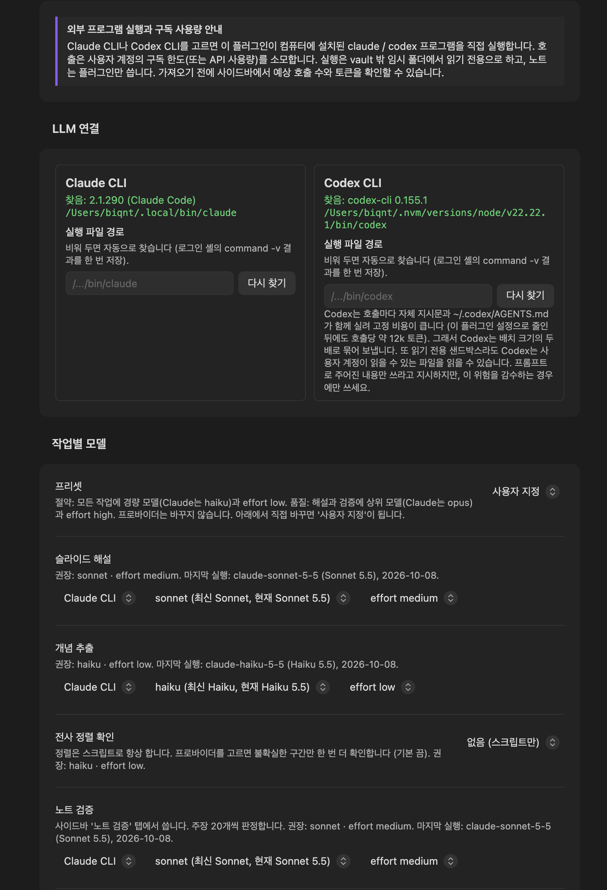
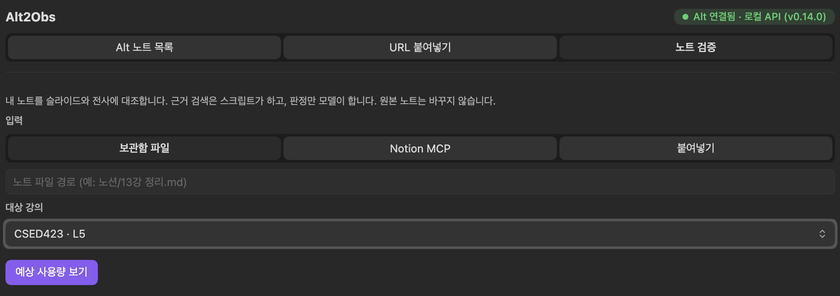

#  Alt2Obs user guide

[한국어](user-guide.ko.md) · [README](../README.md)

This guide covers everything Alt2Obs does, from setup to troubleshooting. The plugin's interface is in Korean, so this guide quotes each label exactly as it appears on screen, followed by an English gloss: **가져오기** (import).

Try the plugin on a copy of your vault first if you have a lot of existing lecture notes.

## Contents

- [Before you start](#before-you-start)
- [Setup](#setup)
- [Importing a lecture](#importing-a-lecture)
- [The generated notes](#the-generated-notes)
- [Synced Viewer](#synced-viewer)
- [Lectures without slides](#lectures-without-slides)
- [Note verification](#note-verification)
- [Migrating from older versions](#migrating-from-older-versions)
- [Settings reference](#settings-reference)
- [Troubleshooting](#troubleshooting)
- [FAQ](#faq)
- [Tested versions and known limitations](#tested-versions-and-known-limitations)

## Before you start

Alt2Obs does not call a model itself. It runs the Claude Code CLI or the Codex CLI on your computer, logged in to your own account. Install one of them and log in once in a terminal:

```bash
# Claude Code
npm install -g @anthropic-ai/claude-code   # or the official installer
claude                                      # run once and log in

# Codex
npm install -g @openai/codex
codex login
```

Every call counts against your plan's limits or your API usage. The [README](../README.md#requirements) lists the full requirements, and its [privacy section](../README.md#privacy-and-disclosures) lists what is sent where.

## Setup

Open **Settings → Alt2Obs**. The box at the top (외부 프로그램 실행과 구독 사용량 안내, running external programs and plan usage) is a reminder that the plugin runs your CLI.

<p align="center"></p>

### LLM connection

Under **LLM 연결** (LLM connection) there is a card for **Claude CLI** and one for **Codex CLI**.

- A CLI that was found shows `찾음: <version>` (found) and its path. A warning under it means the version is older than the tested one, or that its help text does not list every option the plugin uses.
- **실행 파일 경로** (executable path): leave it empty to find the CLI automatically, or enter an absolute path.
- **다시 찾기** (search again) runs the search again.

How the search works: Obsidian started from the Dock or the Start menu does not see your terminal's PATH (nvm and similar tools set it in your shell). So the plugin runs `command -v claude` once in your login shell (`where` on Windows) and also looks in common install folders: nvm, Homebrew, `~/.local/bin`, `~/.claude/local`, `~/.npm-global/bin`, `~/.volta/bin`, `~/.bun/bin`, `/usr/local/bin` (on Windows `%APPDATA%\npm`, `%LOCALAPPDATA%\Programs\claude` and others). Every executable it finds is checked with `--version` and its help text (`claude --help`, `codex exec --help`), with no model call. One that lacks an option the plugin uses is skipped, and the newest one with every option is saved.

On the first start the plugin also checks `claude auth status`. If the Claude CLI is logged in, the tasks use it; if not and the Codex CLI is installed, the tasks are set to the Codex CLI and a notice tells you so.

The Codex card adds a note: each Codex call carries Codex's own instructions and your `~/.codex/AGENTS.md`, about 12k tokens per call even after the plugin trims what it can. To spread that cost, Codex gets twice the batch size. Codex's read-only sandbox can still read files your account can read; the prompt tells it to use only the material it is given, but choose Codex only if you accept that.

**이전 API 키 지우기** (remove old API keys) appears only while API keys from 1.x or early betas are still stored in `data.json`. Nothing uses them now; they stay so a rollback keeps working. The button asks for a second click.

### Task models

Under **작업별 모델** (models per task) each task has a provider, a model and an effort dropdown.

| Task | Used for | Default |
|---|---|---|
| **슬라이드 해설** (slide commentary) | per-slide commentary, the overview, summary note sections | Claude CLI, `sonnet`, effort medium |
| **개념 추출** (concept extraction) | concept notes; also the Notion page fetch when this task is on the Claude CLI | Claude CLI, `haiku`, effort low |
| **전사 정렬 확인** (alignment check) | an optional check of uncertain transcript spans | **없음 (스크립트만)** (none, script only) |
| **노트 검증** (note verification) | judging the claims of your notes | Claude CLI, `sonnet`, effort medium |

On the Codex CLI the model defaults to Codex's own default model, with the same efforts. Each row shows its recommended setting (권장) and, after a run, the model the CLI actually used (마지막 실행, last run).

- **Model list.** Versioned entries such as `Opus 5.5 (claude-opus-5-5)` pass that exact id to the CLI, so you always get the same model. Aliases such as `sonnet` follow the CLI's latest model; the label shows what it pointed to on the last run, for example `sonnet (최신 Sonnet, 현재 Sonnet 5.5)`. The list comes from the model lists Claude Code and Codex keep on disk (no model call), or from a built-in list. **CLI 기본값** (CLI default) uses the CLI's own default model, and **직접 입력...** (enter manually) takes any other id.
- **Effort.** The list shows only the levels the chosen model supports (`low`, `medium`, `high`, `xhigh`, `max`, or **effort CLI 기본값**). A model without effort levels, such as Haiku 4.5, offers only the CLI default.
- **프리셋** (preset): **절약** (saving) puts every task on the light model (Claude: `haiku`) with effort low. **품질** (quality) puts commentary and verification on the top model (Claude: `opus`) with effort high. Presets never change the provider. Any manual change switches to **사용자 지정** (custom).

These are defaults. Before each import or verification you can change the model for that run only (see [the estimate panel](#the-estimate-panel)).

**Notion MCP 조회 도구** (Notion MCP fetch tool) is described under [Note verification](#notion-mcp-setup). The remaining settings are listed in the [settings reference](#settings-reference).

## Importing a lecture

Select the book icon in the ribbon (**Alt 강의 가져오기**, import an Alt lecture) or run the command **Open sidebar**. The sidebar has three tabs: **Alt 노트 목록** (Alt note list), **URL 붙여넣기** (paste URL) and **노트 검증** (note verification). **최근 가져온 노트** (recently imported notes) at the bottom lists your last imports. The command **Import lecture note (local list or URL)** also opens the sidebar.

<p align="center"></p>

### The Alt note list

The status chip at the top shows how the plugin reaches Alt:

- `Alt 연결됨 · 로컬 API` (connected, local API): Alt is running and the plugin reads it through Alt's local API.
- `Alt 꺼짐 · DB 읽기` (Alt closed, reading the database): the plugin reads a private copy of Alt's database.
- `연결 안 됨` (not connected), with the reason below it.

Select the chip to check again. The list groups lectures by Alt folder and has a search box. Each lecture shows its title, a status chip, a kind chip, the date, the slide count and the transcript length.

Status chips:

- `새 노트` (new): not imported yet.
- `가져옴` (imported): a note exists in the vault.
- `슬라이드 N장 변경` (N slides changed): imported, and N slides changed in Alt since.
- `기존 노트와 연결?` (link to an existing note?): see [Linking an existing note](#linking-an-existing-note).

Kind chips (hover a chip to see Alt's own note type):

| Kind | Meaning | Buttons |
|---|---|---|
| `슬라이드` (slides) | Alt has the slide PDF | **가져오기** (import) |
| `슬라이드(PDF 첨부)` (attached PDF) | you attached a PDF in the plugin | **가져오기**, **Alt 슬라이드로 바꾸기** (switch to Alt slides, when Alt now has slides), **첨부 해제** (detach) |
| `슬라이드(저장된 PDF)` (saved PDF) | Alt has no slides now, but an earlier import saved the PDF next to the slide note | **가져오기**, with that saved PDF |
| `슬라이드(미첨부)` (slides not attached) | made as a slide note in Alt, but no slides attached yet | **새로고침** (refresh), **PDF 첨부** (attach PDF), **요약 노트 만들기** (make a summary note) |
| `노트(전사만)` (note, transcript only) | made as a note in Alt: a recording and its transcript | **요약 노트 만들기** (default), **PDF 첨부** |
| `노트(전사 없음)` (no transcript) | neither slides nor a transcript | **강의 노트 만들기** (make a lecture note from Alt's summary and memo) |

For `슬라이드(미첨부)`, attach the slides in Alt and select **새로고침** first; the other two buttons are for when you want a note now. If a slide file has not been downloaded to this computer yet, the panel says so: open the slides once in Alt, then select **새로고침**. Imported lectures also get **뷰어로 열기** (open in viewer) and **노트 열기** (open note), and **가져오기** becomes **다시 가져오기** (import again).

Below the list, **과목** (subject) is the subject folder the note goes to. It is guessed from the Alt folder (`Alt 폴더에서 추정`) or the title (`제목에서 추정`), or taken from the existing note (`기존 노트`); you can change it. The line under it shows whether the transcript will be matched to the slides, for example `전사 타임스탬프 있음 · 슬라이드에 자동 정렬` (transcript has timestamps, aligned to slides automatically). Alignment is a script and always runs when timestamps exist.

If you select **가져오기** for a lecture without a slide PDF, the import stops before any token is spent and offers the same choices: **요약 노트 만들기**, **PDF 첨부**, or **취소** (cancel). Nothing silently falls back to a note without slides.

### The estimate panel

Before anything is sent, **가져오기 전 예상 사용량** (estimated usage before import) shows the number of calls, the input and output tokens, and the images to send, followed by details:

- slides generated and skipped (cover, contents and closing slides, duplicate animation steps, unchanged slides),
- how much the transcript was compressed,
- the alignment result (`전사 정렬: 슬라이드별 구간 N개`) and how many spans are uncertain,
- key diagram images to save, and which PDF is used when it is an attached or saved one.

Two model pickers let you change the provider, model and effort for this run: **해설·요약 모델** (commentary and summary model) and **개념 추출 모델** (concept model). For a summary note the first one is **구간 요약·전체 요약 모델** (section and overview model). The choice applies to this run only (이번 실행에만 씁니다); **기본값으로 저장** (save as default) writes it to the settings. The estimate is recalculated at once.

The estimate scales output tokens with effort (medium is the baseline), does not change with the model, and leaves out retries. Then:

- **시작** (start) runs the import.
- **이미지 줄이기** (fewer images) appears when slide images would be sent: diagram slides that have text are sent as text only.
- **취소** (cancel) stops without spending anything.

If the estimate is over **강의당 토큰 상한** (token cap per lecture), the panel says so and the button becomes **상한 무시하고 시작** (start anyway), which needs a second click.

### Progress and cancel

While it runs, the panel shows the steps (준비, 슬라이드 해설, 전체 요약, 개념 추출, 저장: preparing, commentary, overview, concepts, saving), the batch progress and the live usage. **취소** stops the CLI at any point before saving, and the note is left unchanged. Slides whose answer fails the checks are asked for once more, and a call that runs longer than **CLI 호출 제한 시간** (CLI timeout) is stopped and tried once more in two halves. Slides that still fail keep their earlier commentary, if the note had one, and are listed under `## ⚠️ 처리 실패 슬라이드` in the note. The import stops early when the CLI is missing or not logged in, when it reports a usage limit, or when two calls fail in a row.

A slide lecture opens in the [Synced Viewer](#synced-viewer) when it is done.

### Importing again

Importing a lecture again regenerates only what changed. A slide whose text hash and image signal are both unchanged keeps its commentary (setting **바뀐 슬라이드만 다시 생성**, regenerate only changed slides). Before the note is written, **기존 노트 업데이트** (update existing note) lists the added and removed sections and concepts and the slide changes; select **업데이트** (update) or **취소**.

If more than half of the existing slides do not match the new deck, you may be importing a different lecture onto this note. The dialog then asks you to tick a box before it updates, and the memos of unmatched slides move to `## 🗑️ 삭제된 슬라이드 (orphan)` at the end of the note.

### Linking an existing note

A note made by 1.x or from a share link only knows the public Alt id. When a lecture in the Alt list has the same title and date as such a note, it shows `기존 노트와 연결?`. Select **연결** (link) next to the note path and confirm: the plugin adds `alt_local_id` to that note's frontmatter and changes nothing else. Later imports then update that note and keep your memos. Nothing is linked automatically; when another lecture note has the same title, the new note's file name gets the lecture date.

### Importing from a share link

Use the **URL 붙여넣기** tab for a lecture that is not in the Alt app on this computer (another computer, or a note shared with you).

1. In the Alt app, open the note, select **Share** (공유) and **Copy link** (링크 복사). The link looks like `https://www.altalt.io/en/note/0a471d1c-4ec6-4101-8de2-ccc1781770d4`. The note must be shared with "anyone with the link" or public; private notes cannot be imported.
2. Paste the link, enter **과목명** (subject name) or pick an existing subject chip (empty: guessed), and select **가져오기**.
3. The [estimate panel](#the-estimate-panel) follows, as for local lectures.

Share links have limits: the transcript has no timestamps, so each slide gets an even share of it, and Alt's summary is often empty. If Alt has a summary for the note, the overview and concepts use it. If the slide PDF cannot be downloaded, the plugin says so and offers **다시 시도** (retry) first.

## The generated notes

### Folder layout

```
Alt2Obsidian/                      ← 저장 폴더 (save folder) setting
└── CSED311/                       ← subject
    ├── Lectures/
    │   ├── CSED311 Lec7-pipelined-CPU.md     ← lecture note
    │   └── CSED311 Lec7-pipelined-CPU.pdf    ← slide PDF, found by the viewer next to the note
    ├── Concepts/
    │   └── Pipeline Hazard (파이프라인 해저드).md
    ├── Verification/
    │   └── CSED311 Lec7-pipelined-CPU verification.md
    └── Attachments/
        └── CSED311 Lec7-pipelined-CPU-12.png ← key diagram (optional)
```

The default folder keeps its pre-2.0.0 name `Alt2Obsidian/`. Vaults made by 1.x keep lecture notes directly in the subject folder; see [Migrate the 1.x folder layout](#migrate-the-1x-folder-layout).

### Slide note

```markdown
---
title: "CSED311 Lec7-pipelined-CPU"
subject: "CSED311"
tags: [csed311, pipeline, cpu-architecture, hazard]
date: "2026-03-25"
source: "alt2obsidian"
slide_count: 32
alt_local_id: "019e8c4f-..."
alt_alignment: "1:0-95.2 2:95.2-210 ..."
alt2obs_usage: {provider: "Claude CLI sonnet", model: "claude-sonnet-5-5", effort: "medium", concept_model: "claude-haiku-4-5-20251001", calls: 14, ...}
---

# CSED311 Lec7-pipelined-CPU

## 📋 전체 요약

<!-- alt2obs:overview start -->
[overview of the lecture, built from Alt's summary and a one-line gist per slide]
<!-- alt2obs:overview end -->

## 📚 슬라이드 1

<!-- alt2obs:slide:1 hash:a3f5b2c1 start -->
[commentary written from the slide text (and image, for diagram slides) and that slide's transcript]

> [!definition] Pipelining
> 여러 명령어를 서로 다른 단계에서 동시에 실행해 throughput을 높이는 기법.

[[Pipeline Hazard (파이프라인 해저드)|Pipeline Hazard]]는 다음 슬라이드에서 다룹니다.
<!-- alt2obs:slide:1 hash:a3f5b2c1 end -->

> [!note] 내 메모
> 시험 전 `lw → add` 사례 다시 보기

## 📚 슬라이드 2
...
```

- `## 📚 슬라이드 N` (slide N) sections match the PDF pages one to one.
- `alt_alignment` stores which part of the recording belongs to each slide; the viewer uses it.
- `alt2obs_usage` records the model and effort the CLI actually used and the tokens spent.
- Slide commentary is in Korean; academic terms and concept names stay in English (`Context Switch`, `vruntime`).
- With **핵심 다이어그램 이미지 저장** (save key diagram images) on, up to 8 diagram-heavy slides per lecture are saved as `Attachments/<lecture>-<page>.png` and embedded at the end of their commentary. The script picks them, so no tokens are spent.

### Summary note

A lecture without slides becomes a summary note (see [Lectures without slides](#lectures-without-slides)):

```markdown
---
title: "6강"
subject: "CSED5"
tags: [csed5, probability, random-variable]
date: "2026-10-06"
source: "alt2obsidian"
alt_kind: "transcript"
section_count: 6
alt_local_id: "01a0cbab-..."
alt_source: "alt-local"
alt2obs_usage: {provider: "Claude CLI sonnet", model: "claude-sonnet-5-5", effort: "low", calls: 3, ...}
---
# 6강

## 📋 전체 요약

<!-- alt2obs:overview start -->
[overview built from the section gists and Alt's summary]
<!-- alt2obs:overview end -->

## ⏱ 구간 1 [00:00~10:46]

<!-- alt2obs:section:1 hash:d46472eb start -->
- random experiment를 단순한 sub-experiment의 sequence로 구성해 다룰 수 있음 [00:00]
- 패킷이 도착하기까지 필요한 전송 횟수가 관심사임 [06:57]

> [!example] 재전송 모델
> A1, ..., A(M-1)은 실패, A(M)은 성공으로 두고 각 전송을 독립으로 가정함

<!-- alt2obs:meta img:none gist:"..." -->
<!-- alt2obs:section:1 hash:d46472eb end -->

> [!note] 내 메모
>

## ⏱ 구간 2 [11:10~19:06]
...
```

`## ⏱ 구간 N [mm:ss~mm:ss]` (section N) covers a stretch of the recording, and each point ends with the time it was said.

### Concept notes

```markdown
---
tags: [concept]
---

# Pipeline Hazard (파이프라인 해저드)

**정의:** Pipeline Hazard는 pipeline CPU에서 다음 명령어가 다음 사이클에 정상 실행되지 못하는 상황이다. ...

**강의 맥락:** 5단계 MIPS pipeline을 도입한 직후, ...

**예시:** `lw $t0, 0($s0)` 바로 뒤에 `add $t1, $t0, $t2`가 오는 코드다. ...

**주의:** Data Hazard와 Structural Hazard를 혼동하기 쉽다. ...

**관련 강의:** [[CSED311 Lec7-pipelined-CPU]]
**관련 개념:** [[Data Hazard (데이터 해저드)]], [[Forwarding (포워딩)]]
```

Each concept note has a definition (정의), the lecture context (강의 맥락), an example (예시), a pitfall (주의), and links to its lectures and related concepts. New concept notes are named `English (한국어)`. Concept notes from before 2.0.0-beta.5 named `한국어 (English)` keep their names; when the same concept comes up again (same English part, or same Korean part with no clearly different English part), the plugin writes into the existing note instead of making a duplicate. Abbreviations and their spelled-out forms count as the same concept (`PTE (Page Table Entry)` and `PTE (페이지 테이블 엔트리)`), but the same abbreviation with different spelled-out names does not (`PC (Program Counter)` and `PC (Personal Computer)`). Links in the commentary point to the note's full name, for example `[[Lottery Scheduling (로터리 스케줄링)|Lottery Scheduling]]`, once per slide, never inside code, headings or longer words. **개념 노트 언어** (concept note language) switches concept notes to English.

### Markers and memos

- `<!-- alt2obs:... -->` lines mark the blocks the plugin manages. A re-import replaces only what is between `start` and `end` and uses the hash to find each slide's memo. Do not delete these lines.
- Write your own notes in the `> [!note] 내 메모` callout under each slide or section, or anywhere outside the managed blocks. They stay on re-import.
- The slide hash is the first 8 hex digits of the SHA-1 of the slide's normalized text, with no page number. That is why memos follow their slide when slides are inserted, deleted or reordered. Pages without text fall back to the note id and page number.
- Memos of slides that disappear move to `## 🗑️ 삭제된 슬라이드 (orphan)`; for summary notes, to `## 🗑️ 사라진 구간 (orphan)` (vanished sections). When two sections merge into one, the other section's memo is kept under the merged section, marked `이전 구간 N [..]의 메모`.
- When a note changes form (a 1.0.x single-block note, or a summary note turned into a slide note), the whole previous note is kept under `## 이전 노트 백업` (previous note backup) at the end. Move your memos from there by hand.
- **관리 주석 숨기기** (hide managed comments, on by default) hides these lines in Live Preview and the Synced Viewer. They show when the cursor is on or next to them, and always in Source mode. Hidden lines cannot be edited by accident. A whole line comment that you write starting with `<!-- alt2obs` is hidden too.

## Synced Viewer

The Synced Viewer shows the slide PDF and its lecture note side by side and scrolls them together.

<p align="center"></p>

Ways to open it:

- Importing a slide lecture opens it (an open viewer tab is reused).
- **뷰어로 열기** (open in viewer) on an imported lecture in the sidebar.
- The command **Open synced viewer (PDF + lecture .md)** while a lecture note or its PDF is open.
- Opening a lecture PDF from the file explorer or a link, when **강의 PDF를 열면 뷰어로 열기** (open lecture PDFs in the viewer) is on (the default). A lecture PDF is a PDF in the same folder as a lecture note with the same name. If a viewer for that lecture is already open, that tab is shown instead. Opening the `.md` note itself does not change anything.

Toolbar: **◀ 이전** and **다음 ▶** (previous and next slide), zoom buttons, **📝 노트 편집** (edit note) and **PDF만 보기** (PDF only), plus the page number. The note pane in the viewer is read only: **📝 노트 편집** opens the note in a normal editor next to the viewer, and the viewer follows your edits. **PDF만 보기** opens the file in Obsidian's own PDF view (search, selection, annotations); that tab stays a PDF. PDF tabs that were already open when Obsidian started, or when you turned the setting on, also stay PDFs.

Scrolling either side moves the other to the same slide. Selecting a `[[wikilink]]` in the note pane opens it; Cmd-click (Ctrl-click on Windows and Linux) opens it in a new tab.

**Transcript panel.** For a note with `alt_alignment`, the toolbar shows `정렬 기준 동기화 · 전사 매칭` (synced by alignment, transcript matched) and a **전사 패널** (transcript panel) button. The panel shows the current slide's part of the transcript with `[mm:ss]` times, marked `(정렬 불확실)` (alignment uncertain) when the match is weak. The transcript is kept in the OS cache folder outside the vault; if it is missing there, it is read from Alt again, so Alt must be reachable.

A note without slides has no viewer. **뷰어로 열기** explains why and offers **PDF 첨부** (attach PDF).

## Lectures without slides

Many Alt lectures are a recording and a transcript only. You can make a summary note from the transcript, or attach the slide PDF and import the lecture like any slide lecture.

### Summary notes

**요약 노트 만들기** (make a summary note) cuts the transcript into sections of 9 to 15 minutes of speech, about 12 minutes each, where the topic changes. A pause longer than a minute counts as one minute. This is a script, so it spends no tokens; a 2-hour lecture gets 8 to 10 sections. Each section gets a bullet summary with the `[mm:ss]` time of each point and definition or example callouts, and the overview and concept notes are made from the section gists. A 2-hour lecture takes 3 calls: section summaries, overview and concepts. The estimate, progress, cancel, usage record and model choice work as for slide lectures.

On a re-import, sections whose transcript did not change keep their summary without a call, and memos stay with their section.

Limits: the summary is only as good as the speech recognition. A transcript from a share link has no times, so its sections are cut by length, carry no times, and the note cannot be used for note verification. Choosing **요약 노트 만들기** ignores any PDF next to the note, and a lecture that already has a slide note is never turned into a summary note.

### Attaching a PDF

**PDF 첨부** (attach PDF) is in the sidebar for `노트(전사만)` and `슬라이드(미첨부)` lectures, in the dialog of a stopped import, and in the command **Attach lecture PDF to the current lecture note** (with a lecture note or its PDF open).

1. In **강의 PDF 첨부** (attach lecture PDF), choose **보관함에서 고르기** (pick from the vault, with search) or **컴퓨터에서 고르기** (pick from this computer).
2. The PDF is copied next to the lecture note as `<subject>/Lectures/<lecture>.pdf`, and the note's frontmatter gets `alt_pdf_source: "attached"`. Files over 300 MB and files that are not PDFs are refused.
3. Import the lecture again from the Alt note list. It is now a slide lecture: per-slide commentary, transcript alignment, the Synced Viewer and verification against the slides.

If the lecture already has a summary note, it becomes a slide note, and the whole summary note with your memos is kept under `## 이전 노트 백업` at the end.

An attached PDF is used before Alt's own PDF, and the estimate says so. When Alt gets slides for that lecture later, the panel shows it, and **Alt 슬라이드로 바꾸기** (switch to Alt slides) removes the `alt_pdf_source` line so the next import uses Alt's PDF. **첨부 해제** (detach) removes the mark.

What happens to the attached file: only a copy the plugin made, unchanged since, goes to the system trash (or the vault's `.trash` folder); it is never deleted for good. The plugin recognizes its copy by the size and SHA-1 it recorded, and the record follows renames and moves. Any other file (a vault PDF that was already next to the note, a file you moved there, a copy you changed) is never deleted: detaching leaves it in place, and switching to Alt slides renames it to `<lecture> (첨부한 PDF).pdf` (numbered if that name exists) so Alt's PDF does not overwrite it. The confirmation dialog says which case applies.

## Note verification

The **노트 검증** (note verification) tab compares notes you wrote with the lecture's slides and transcript. A script finds the evidence; the model only judges. Your note is never changed.

<p align="center"></p>

### Inputs

Under **입력** (input), choose one:

- **보관함 파일** (vault file): a note in the vault, for example a Notion page exported to Markdown.
- **Notion MCP**: a Notion page URL, fetched with **가져오기** (fetch) through the Notion MCP in your Claude Code (one call; select the button again to cancel). See [Notion MCP setup](#notion-mcp-setup).
- **붙여넣기** (paste).

Then choose **대상 강의** (target lecture): any imported lecture note. Summary notes are marked `(전사 요약)` (transcript summary).

### Running it

1. Select **예상 사용량 보기** (show estimate). The panel **검증 전 예상 사용량** (estimate before verification) shows how many claims become how many judgements (`주장 N개 → 판정 M개`), that the evidence search spends no tokens, the missing-slide check, and the calls and tokens. **판정 모델** (judge model) changes the model for this run.
2. Select **검증 실행** (run verification), or **취소** (cancel).
3. The result shows the count of each verdict and **결과 노트 열기** (open the result note).

Verdicts: `맞음` (correct), `틀림` (wrong), `근거 없음` (no evidence), `전사 불확실` (the transcript is unclear, likely a speech recognition error), and `누락 후보` (possibly missing: slides none of your claims cover).

How it works: your note is split into claims (sentences and bullets). For each claim a script finds the top 2 slides and the top 2 aligned transcript spans by term overlap, including a built-in list that maps Korean academic terms to English, so a Korean note can match English slides. A claim that shares only one term with a slide is marked `겹치는 용어 1개` (one shared term). A claim with no direct match borrows candidates from nearby claims and its heading (`(문맥 근거)`, context evidence). Claims with no candidate at all are not judged and are listed under `용어 불일치로 근거 검색 실패` (no evidence found, term mismatch); if more than 30% of the claims end up there, a warning appears before the run. The model judges 20 claims per call. Slides no claim covers are sent once more, title and key sentences only, to pick the possibly missing ones.

The result is saved to `Verification/<lecture> verification.md`, one card per claim with the quote, the verdict, the reason and evidence links such as `[[...#📚 슬라이드 12|<lecture> · 슬라이드 12]]` with transcript times `[mm:ss]`. Running it again keeps whatever you wrote under `## 내 메모` in the result note.

For a summary note the evidence is the transcript sections, and links point to `⏱ 구간 N`. Since the evidence is speech recognition only, broken sentences tend to come back as `전사 불확실`. Summary notes made from a share link have no times and cannot be verified.

### Notion MCP setup

1. In a terminal, add the Notion MCP server to Claude Code:

   ```bash
   claude mcp add --transport http notion https://mcp.notion.com/mcp
   ```

2. Run `claude`, type `/mcp`, and log in to Notion.

The plugin finds the server with `claude mcp list` and `claude mcp get` (no model calls). The fetch call is limited to Notion's fetch tool: no built-in tools, every other Notion tool (create or edit pages and so on) blocked by name, and your own settings and hooks turned off. A Notion server you added yourself (http or sse, without headers) is started alone. A server from a Claude Code plugin is started alone when its `.mcp.json` has an http or sse address; otherwise the plugin's user settings are used with hooks off and other MCP servers blocked. Notion connected as a claude.ai connector uses your MCP list with every other server blocked.

The page text is the fetch tool's own result, not text the model retyped. It is cached outside the vault with the page's last edit time, and the panel says when the page is the same as last time. If the page is long and the result was cut, you get a warning. When Claude Code saved a large result to a file under `~/.claude/projects/**/tool-results/`, the plugin reads the whole page from there.

The fetch uses the concept task's model when that task is on the Claude CLI (otherwise the CLI default), with effort low. If your server has another name, enter the tool in **Notion MCP 조회 도구** (Notion MCP fetch tool) as `mcp__<server>__notion-fetch`. Without a Notion MCP, the panel shows these steps and offers **보관함 파일로 검증** (verify with a vault file).

## Migrating from older versions

### Migrate the 1.x folder layout

1.x kept lecture notes directly in the subject folder. Run **Migrate 1.x vault layout** from the command palette:

1. The dialog **1.x 폴더 구조 옮기기** (move the 1.x folder layout) lists the lecture notes and their PDFs it would move into `Lectures/`.
2. Select **옮기기 (N개)** (move N files). Files are moved with Obsidian's rename, so links to them are updated.

Nothing is deleted or overwritten. A file whose target already exists is skipped and listed. `Concepts/` stays, and old exam summaries in `Exam/` and your own notes are left alone. Running it again does nothing to files already moved.

The first re-import of a 1.x note marks every slide as changed once, because the slide hash changed in 2.0. Memos are kept.

### From 1.x or a 2.0.0 beta

Install the new version over the old one: the id and folder (`alt2obsidian`) are the same, so it updates in place and keeps your settings, records, hotkeys and open tabs. Coming from 1.x or an early beta, the first start moves tasks that used the removed Gemini API or Ollama to a logged-in Claude CLI (or an installed Codex CLI) and fills empty model and effort fields with the task defaults; a notice lists what changed. If a task used Ollama, its slide text and transcript now go to a cloud model. CSS snippets written for the old `alt2obsidian-*` classes need the `alt-to-obs-*` classes. If you need the 1.x Gemini workflow, use [1.1.0](https://github.com/BiQnT/alt2obsidian/releases/tag/1.1.0).

### Coming from 2.0.0 (id `alt-to-obs`)

2.0.0 alone was released under the id `alt-to-obs`; 2.0.1 went back to `alt2obsidian`. Obsidian treats them as two plugins, both listed as "Alt2Obs" (tell them apart by version).

1. Install the new version (folder `.obsidian/plugins/alt2obsidian/`). Leave the `alt-to-obs` folder alone: if you delete it before the new version starts, its settings cannot be imported.
2. In **Settings → Community plugins**, disable the Alt2Obs whose version is 2.0.0. Do not delete it yet.
3. Enable the new Alt2Obs. A notice says it imported 2.0.0's settings and records (CLI paths, usage, recent notes, attachment records; old API keys are left out). Check the save folder, LLM connection and task models in **Settings → Alt2Obs**.
4. Delete Alt2Obs 2.0.0. Notes and folders stay as they are.
5. Set again any hotkeys you gave to 2.0.0's commands.

Details:

- While 2.0.0 is still enabled, every start shows a warning, and neither plugin turns lecture PDFs into the viewer. If 2.0.0 tells you to disable and delete "Alt2Obsidian", it means the new version: ignore it.
- If the new version's own `data.json` changed after 2.0.0's (you went back to 1.x or a beta after 2.0.0), that data is kept, and a one-time notice names the file that was left out. The command **Import settings from version 2.0.0 (alt-to-obs)** imports it anyway, after a confirmation.
- If 2.0.0's `data.json` cannot be read, you are told, and every start tries again until it can be read.
- Once 2.0.0 is off, tabs it left open are reopened as views of the new version.

## Settings reference

| Setting | What it does | Default |
|---|---|---|
| **LLM 연결** → **실행 파일 경로** | Path of the Claude CLI or Codex CLI; empty means automatic search | empty (automatic) |
| **작업별 모델** → **프리셋** | **절약**, **품질** or **사용자 지정** (see [Task models](#task-models)) | 사용자 지정 |
| **작업별 모델** → each task | Provider, model and effort per task | see [Task models](#task-models) |
| **Notion MCP 조회 도구** | The tool used to fetch Notion pages, `mcp__<server>__notion-fetch` | empty (found with `claude mcp list`) |
| **배치 크기** (batch size) | Slides per CLI call; half when the batch has images; twice for Codex | 8 |
| **이미지 전송 규칙** (image rule) | **자동** (auto): images only for diagram-heavy slides and scanned PDFs, 1024 px JPEG. **텍스트만 (스캔 PDF 제외)** (text only, except scanned PDFs) | 자동 |
| **슬라이드당 전사 상한 (자)** (transcript cap per slide, characters) | Transcript kept per slide after removing fillers and repeats | 600 |
| **강의당 토큰 상한** (token cap per lecture) | Stop before starting when the estimate is over it; 0 means no cap | 0 |
| **CLI 호출 제한 시간 (초)** (CLI timeout, seconds) | A call over this is stopped; a timed-out batch is tried once more in two halves (minimum 30) | 300 |
| **바뀐 슬라이드만 다시 생성** (regenerate only changed slides) | Reuse commentary when a slide's text hash and image signal are unchanged; summary notes reuse unchanged sections | on |
| **핵심 다이어그램 이미지 저장** (save key diagram images) | Save up to 8 diagram-heavy slides per lecture to `Attachments/` and embed them | on |
| **누적 사용량** (total usage) | Lectures, calls, tokens and images so far; **초기화** (reset) clears it | |
| **관리 주석 숨기기** (hide managed comments) | Hide `<!-- alt2obs:... -->` lines in Live Preview and the viewer | on |
| **강의 PDF를 열면 뷰어로 열기** (open lecture PDFs in the viewer) | Turn a lecture PDF tab into the Synced Viewer | on |
| **저장 폴더** (save folder) | Vault folder for lecture, concept and verification notes | `Alt2Obsidian` |
| **Alt 데이터 폴더** (Alt data folder) | Alt's data folder, read only; empty means the default location | empty |
| **개념 노트 언어** (concept note language) | **한국어** or **English** concept notes | 한국어 |

## Troubleshooting

**"claude CLI를 찾지 못했습니다" (CLI not found).** Obsidian started from the Dock or the Start menu does not see your terminal's PATH. In a terminal run `command -v claude` (Windows: `where claude`), paste the absolute path into **실행 파일 경로** on the CLI card, or select **다시 찾기**. The same applies to `codex`.

**The CLI is too old.** A CLI older than the tested version (Claude Code 2.1.283, Codex 0.155.1) still works when its help lists every option the plugin uses; the card shows a warning. An executable missing an option is not used: the message lists each executable found, its version and the missing options. Update with `claude update` or `npm i -g`, or enter the path of a newer copy. If a run fails with an unknown option, update the CLI.

**"Claude Code나 Codex CLI가 필요합니다" (a CLI is needed).** No logged-in Claude CLI and no Codex CLI was found on the first start. Install one, log in, then select **다시 찾기** under **LLM 연결**.

**Alt shows `연결 안 됨` (not connected).** The reason is shown under the status chip:

- Alt is not running and its database cannot be read: start Alt and select the status chip.
- `Alt 설정에서 로컬 HTTP 서버가 꺼져 있습니다`: Alt's local HTTP server is off in Alt's settings.
- The token file cannot be read, or Alt rejects the token: restart Alt, then refresh.
- The program on Alt's port could not be confirmed as Alt: the plugin does not send the token and reads the database copy instead.
- Reading the database while Alt is closed needs the built-in SQLite of Obsidian's Node (`node:sqlite`, Node 22.5 or later). An older Obsidian installer lacks it: install the latest Obsidian or start Alt.
- `알 수 없는 Alt 데이터베이스 스키마` (unknown database schema): start Alt so the local API is used.
- Alt keeps its data somewhere else: set **Alt 데이터 폴더**.

**The slide PDF is not on this computer.** A slide file synced to Alt from elsewhere may not be downloaded to this computer yet. Open the slides once in Alt, then select **새로고침** (refresh).

**The import stops at the token cap or a usage limit.** Lower the effort, use **이미지 줄이기**, raise **강의당 토큰 상한**, or wait for your plan's limit to reset.

**A lecture PDF opens as a plain PDF.** The PDF must be in the same folder as a lecture note with the same name, and **강의 PDF를 열면 뷰어로 열기** must be on. Tabs that were open at startup, and tabs opened with **PDF만 보기**, stay PDFs. While Alt2Obs 2.0.0 is also enabled, no PDF is turned into the viewer.

**I cannot type on some lines.** Those are hidden managed comment lines. Switch to Source mode to see them, or turn off **관리 주석 숨기기**.

**Windows.** The CLI is found with `where`, then `%APPDATA%\npm`, `%USERPROFILE%\.local\bin`, `%LOCALAPPDATA%\Programs\claude` and similar folders. An npm `claude.cmd` or `codex.cmd` is run without a shell by starting its JavaScript file with `node.exe`, so `node.exe` must be on PATH or in the same folder; a native `claude.exe` runs as is. Cancelling ends the process tree with `taskkill /T /F`. `where` prints paths in the console code page, so a user name with non-ASCII letters (Korean, for example) can garble its output; the folder search then finds the CLI instead. Windows is covered by unit tests only so far.

## FAQ

**Do I need the Alt app?** For the local lecture list, yes, on the same computer. Without it you can import lectures from public Alt share links, without transcript timestamps.

**Does it cost money?** The plugin is free. Each call uses your Claude or ChatGPT plan, or your API usage. The estimate panel shows the expected calls and tokens before every run, and the note records what was used.

**Which model should I pick?** Start with the defaults: `sonnet` with medium effort for commentary and verification, `haiku` with low effort for concepts. **절약** moves every task to the light model with low effort; **품질** moves commentary and verification to the top model with high effort, at a higher cost. The estimate panel shows the difference before you start.

**Can I edit the generated commentary?** You can, but text inside a managed block is replaced when that slide changes and is generated again. Put your own text in `> [!note] 내 메모` or outside the managed blocks.

**Can I delete the `<!-- alt2obs ... -->` lines?** Please don't. Re-imports use them to keep your memos with the right slide.

**What happened to exam summaries and Gemini?** 2.0 removed exam summaries, since Alt's own quiz and flashcard plugins cover them; existing `Exam/` files stay. Gemini API and Ollama support was removed in 2.0.0-beta.4; for them, use [1.1.0](https://github.com/BiQnT/alt2obsidian/releases/tag/1.1.0).

**Does it work on mobile?** No. It runs desktop CLIs, so it is desktop only.

**Can I import without Obsidian running?** The `/alt2obs` Claude Code Skill in this repository imports a lecture from a Claude Code session with the same prompts, helper scripts and note format. See [scripts/phase2/README.md](../scripts/phase2/README.md).

## Tested versions and known limitations

| Item | Version |
|---|---|
| OS | macOS (Windows and Linux: unit tests only) |
| Obsidian minimum | 1.7.2 (the newest API the plugin uses) |
| Obsidian | 1.14.4 app code, 1.12.4 installer |
| Alt | 0.14.0 (local database), 0.12.0 (local API) |
| Claude Code CLI | 2.1.291 |
| Codex CLI | 0.155.1 |

Known limitations:

- **Summary notes** come from speech recognition only, so stretches with little or misheard speech give thin or wrong summaries. The file picker and sidebar buttons of the PDF attach flow have not been checked in a real Obsidian window yet.
- **Windows and Linux** have not been tried on a real computer. The Windows CLI handling (`where`, npm `.cmd` shims, `taskkill`) and the Alt ownership check (`netstat`, `tasklist`) are covered by unit tests.
- **2.0.1's return to the id `alt2obsidian`** (importing 2.0.0's data, the warning while both plugins are enabled, reopening 2.0.0's tabs) and the PDF.js worker inside `main.js` were checked with a fake vault and headless Chromium tests, not yet in a real Obsidian window.
- **Notion MCP** was checked with real calls only for a Notion server added by hand. claude.ai connectors and servers from Claude Code plugins are covered by fake CLI tests.
- **Alignment accuracy** figures (80.4% and 62.9% on two lectures, against 9.9% and 3.0% for an even split) come from draft labels that are still to be confirmed.
- **Tokens**: for a 141-minute, 46-slide lecture the Claude CLI estimate is about 73k input tokens, 68% of the 1.1.0 Gemini estimate (about 108k). A measured benchmark is still to come.

<!--
Images to capture
- docs/assets/screenshot-settings.png: Settings → Alt2Obs, the "LLM 연결" section with both CLI cards (one found, showing "찾음: <version>" and the path) and the "작업별 모델" table with its provider, model and effort dropdowns. About 1440 px wide.
- docs/assets/screenshot-import.png: shared with the README (sidebar "Alt 노트 목록" tab with kind and status chips and the "가져오기 전 예상 사용량" panel).
- docs/assets/screenshot-viewer.png: shared with the README (Synced Viewer with the transcript panel open).
- docs/assets/screenshot-verify.png: the sidebar "노트 검증" tab after a run, showing the verdict counts (맞음, 틀림, 근거 없음, 전사 불확실, 누락 후보) and the "결과 노트 열기" button. Sidebar width.
-->
